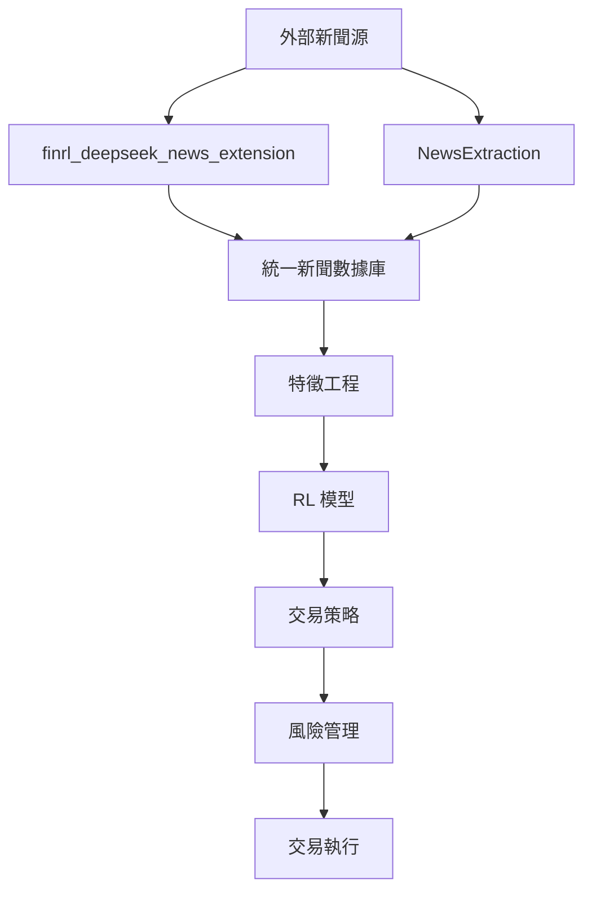

# MindfulRL-Intraday 主專案文檔

## 📖 專案概述

MindfulRL-Intraday 是一個綜合性的強化學習交易系統，專注於日內交易策略的開發和實施。本專案整合了多個子模組，提供完整的數據處理、特徵工程、模型訓練和交易執行pipeline。

## 🏗️ 總體架構

```
MindfulRL-Intraday/
├── 📊 數據層
│   ├── finrl_deepseek_news_extension/    # 新聞數據爬取和處理
│   └── NewsExtraction/                   # 新聞提取和分析
├── 🧠 模型層  
│   ├── RL Models/                        # 強化學習模型
│   └── Feature Engineering/              # 特徵工程
├── 💼 交易層
│   ├── Strategy Implementation/          # 策略實現
│   └── Risk Management/                  # 風險管理
└── 🔧 工具層
    ├── Configuration/                    # 配置管理
    └── Utilities/                        # 通用工具
```

## 🔗 子模組整合

### **數據處理模組**

#### 1. FinRL-DeepSeek 新聞爬取系統
- **位置**: `finrl_deepseek_news_extension/`
- **功能**: 擴展 FinRL-DeepSeek 數據集，提供 2024-2025 年新聞數據
- **詳細文檔**: [📋 finrl_deepseek_news_extension/CLAUDE.md](finrl_deepseek_news_extension/CLAUDE.md)
- **主要特色**:
  - 10+ 新聞源整合 (Finnhub, Alpha Vantage, Yahoo, Google News, GDELT, SEC, Reddit, IBKR)
  - 智能LLM評分系統 (OpenAI API)
  - 企業級成本控制和監控
  - 無縫向後兼容

#### 2. 新聞提取系統
- **位置**: `NewsExtraction/`
- **功能**: 專門的新聞內容提取和預處理
- **詳細文檔**: [📋 NewsExtraction/CLAUDE.md](NewsExtraction/CLAUDE.md)
- **主要特色**:
  - 高效新聞內容提取
  - 多源新聞聚合
  - 智能去重和內容標準化

### **數據流向圖**



## 🚀 快速開始

### **環境設置**

```bash
# 1. 克隆專案
git clone <repository-url>
cd MindfulRL-Intraday

# 2. 創建虛擬環境
python -m venv venv
source venv/bin/activate  # Linux/Mac
# 或 venv\Scripts\activate  # Windows

# 3. 安裝依賴
pip install -r requirements.txt

# 4. 配置 API Keys
cp .env.template .env
# 編輯 .env 文件，添加必要的 API 密鑰
```

### **子模組初始化**

```bash
# 初始化新聞爬取模組
cd finrl_deepseek_news_extension
python check_setup.py
python scripts/test_enhanced_integration.py

# 初始化新聞提取模組
cd ../NewsExtraction
python setup_extraction.py  # 如果存在
```

## 📋 配置管理

### **全局配置結構**

```
config/
├── global_config.json           # 主專案全局配置
├── finrl_deepseek_news_extension/
│   ├── config.json              # 新聞爬取配置
│   ├── enhanced_config.json     # 增強功能配置
│   └── news_config.json         # 新聞源配置
└── NewsExtraction/
    └── extraction_config.json   # 提取配置
```

### **配置優先級**

1. **環境變數** (最高優先級)
2. **命令行參數**
3. **模組特定配置**
4. **全局配置**
5. **預設值** (最低優先級)

## 🧪 測試策略

### **測試層級**

```bash
# 1. 單元測試 - 各子模組內部
cd finrl_deepseek_news_extension && python -m pytest tests/
cd NewsExtraction && python -m pytest tests/

# 2. 整合測試 - 模組間整合
python tests/test_integration.py

# 3. 端到端測試 - 完整流程
python tests/test_e2e_pipeline.py

# 4. 性能測試
python tests/test_performance.py
```

## 📊 監控和日誌

### **日誌結構**

```
logs/
├── main_pipeline.log            # 主流程日誌
├── finrl_deepseek_news_extension/
│   └── enhanced_finrl_extension.log
├── NewsExtraction/
│   └── extraction.log
└── system/
    ├── performance.log          # 性能監控
    └── errors.log              # 錯誤集中日誌
```

### **監控指標**

- **數據質量**: 新聞數據完整性、時效性
- **系統性能**: 處理速度、記憶體使用、API 調用頻率
- **成本控制**: API 使用成本、資源消耗
- **交易績效**: 策略表現、風險指標

## 🔧 開發工作流程

### **新功能開發**

1. **需求分析** - 確定功能範圍和影響的子模組
2. **設計階段** - 更新相應的 CLAUDE.md
3. **實現階段** - 在對應子模組中開發
4. **測試階段** - 單元測試 → 整合測試 → 端到端測試
5. **文檔更新** - 同步更新所有相關 CLAUDE.md
6. **部署上線** - 分階段部署和監控

### **跨模組協作**

- **API 契約** - 定義模組間的介面規範
- **數據格式** - 統一的數據交換格式
- **錯誤處理** - 一致的錯誤傳播機制
- **版本管理** - 模組版本相容性矩陣

## 📈 性能優化

### **系統級優化**

- **並行處理** - 多個子模組並行運行
- **資源調度** - 動態資源分配
- **緩存策略** - 跨模組數據緩存
- **負載均衡** - API 調用負載分散

### **模組級優化**

詳見各子模組的 CLAUDE.md：
- [finrl_deepseek_news_extension 性能優化](finrl_deepseek_news_extension/CLAUDE.md#性能優化)
- [NewsExtraction 性能優化](NewsExtraction/CLAUDE.md#性能優化)

## 🛠️ 故障排除

### **常見問題**

1. **模組間通信失敗**
   ```bash
   # 檢查模組狀態
   python scripts/check_module_health.py
   
   # 重新初始化連接
   python scripts/reinit_modules.py
   ```

2. **配置衝突**
   ```bash
   # 驗證配置
   python scripts/validate_config.py
   
   # 重置為預設配置
   python scripts/reset_config.py --module all
   ```

3. **性能瓶頸**
   ```bash
   # 性能分析
   python scripts/performance_analysis.py
   
   # 資源監控
   python scripts/resource_monitor.py
   ```

## 📚 相關文檔

### **子模組文檔**
- [📋 FinRL-DeepSeek 新聞爬取系統](finrl_deepseek_news_extension/CLAUDE.md)
- [📋 新聞提取系統](NewsExtraction/CLAUDE.md)

### **API 文檔**
- [🔌 模組間 API 規範](docs/api_specifications.md)
- [📊 數據格式規範](docs/data_formats.md)

### **部署文檔**
- [🚀 部署指南](docs/deployment_guide.md)
- [⚙️ 運維手冊](docs/operations_manual.md)

## 📞 技術支援

### **聯絡方式**
- **主專案維護者**: [聯絡信息]
- **新聞爬取模組**: 參見 [finrl_deepseek_news_extension/CLAUDE.md](finrl_deepseek_news_extension/CLAUDE.md)
- **新聞提取模組**: 參見 [NewsExtraction/CLAUDE.md](NewsExtraction/CLAUDE.md)

### **問題回報**
1. **確定問題範圍** - 確認屬於哪個子模組
2. **收集信息** - 日誌、配置、環境信息
3. **建立 Issue** - 在對應的專案倉庫
4. **追蹤處理** - 定期檢查處理進度

---

## 📝 文檔維護

**最後更新**: 2024-07-16  
**維護者**: MindfulRL-Intraday 開發團隊  
**版本**: v1.0.0

**文檔更新流程**:
1. 功能變更時同步更新對應 CLAUDE.md
2. 月度文檔一致性檢查
3. 季度文檔架構回顧和優化