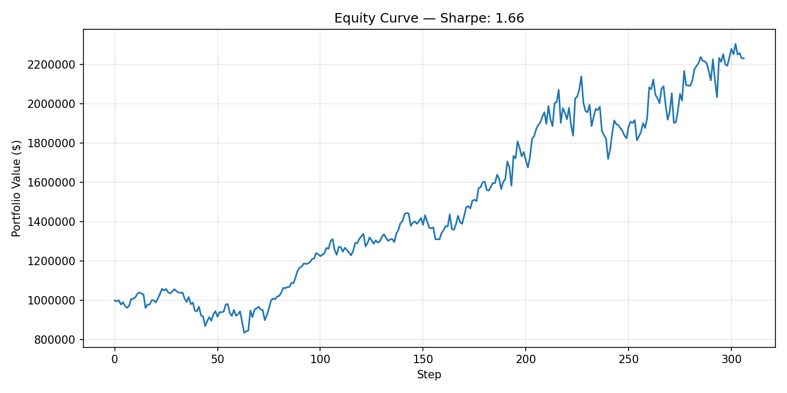
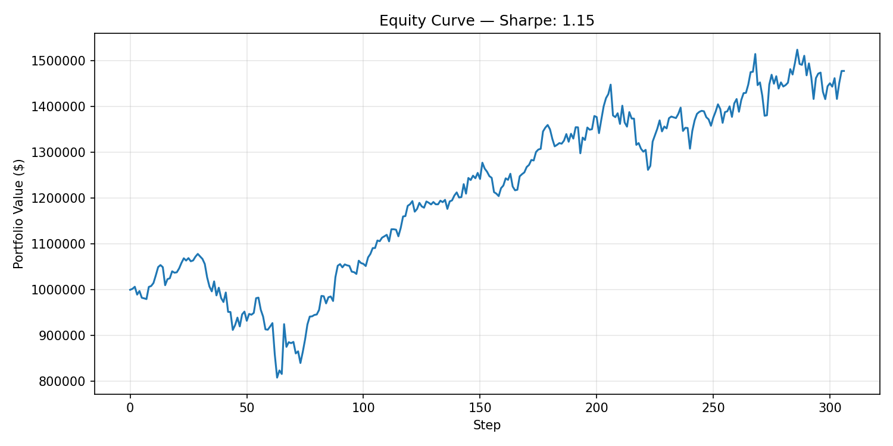
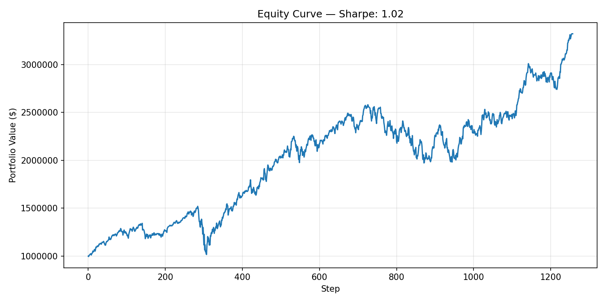
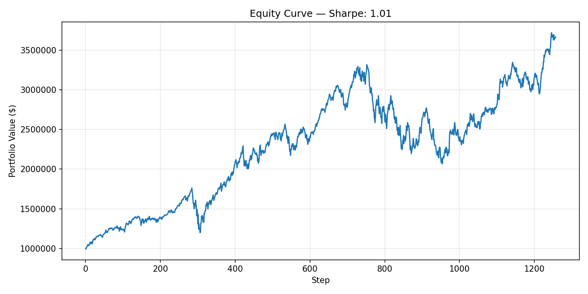
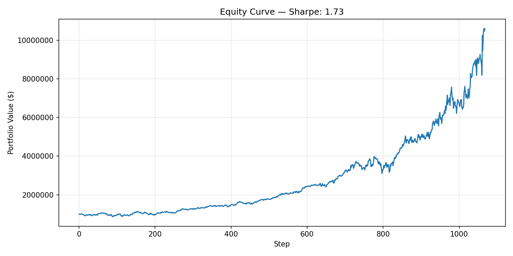

# RL Policy Collapse — Diagnosis and VecNormalize Fix

> **Date**: 2026-04-25
> **Status**: state-sensitivity restored; OOS predictive value not yet proven
> **Conclusion**: RL subsystem upgraded from "broken experiment" to "experimental model worth shadow tracking"; **NOT** approved for production investment recommendations
> **Related**: archive/RL_PIPELINE_DESIGN.md (removed 2026-06-07, recoverable via git; see docs/design/archive/README.md) (training-phase design). Inference roadmap (`RL_INFERENCE_SERVICE.md`) retired during Group 3 consolidation — pause rationale lives in this document + priority map P3.1.
> **Update 2026-06-03**: the RL→agent integration was retired — the 3 `get_rl_*` tools were removed from the registry and both agent bridges (commits `94861f7`, `6b49c74`), and the RL research code (inference + diagnostic probes) was consolidated under `training/` (`training/rl/`, `training/research/`). The pause rationale below is unchanged; RL code is kept offline as reproducible research. §8 below describes the 2026-04-25 service-layer state and is historical.

---

## 1. TL;DR

Three facts that must stay separate:

1. **Engineering problem solved.** All ~21 PPO checkpoints prior to 2026-04-25 had policy collapse — deterministic actions were near state-invariant across dates. Adding `VecNormalize(norm_obs=True)` to training, plus aligned manual normalization in inference/replay, breaks this collapse. The diagnostic toolchain (state parity, policy sensitivity probe, ensemble scan, replay baselines, telemetry+metric extraction) is now production-quality infrastructure.
2. **In-sample training performance is strong but does not constitute investment evidence.** The new 100-epoch VecNormalize model achieves training-replay episode reward +1606 / Sharpe 2.15 / final asset $16.94M (vs OLD's +427 / 1.26 / $5.31M). This is full in-sample, deeply contaminated by overfit risk, and uses an action vector that hits the [-1, +1] bounds — a sign the policy is aggressive and potentially fragile to regime shift.
3. **There is no OOS predictability evidence.** Across 8 post-training trading days (2026-04-14 through 2026-04-23), signal↔next-day-return correlation has mean -0.06. Eight days is too small to declare failure, but it is large enough to refuse promotion to production.

**Historical service-layer status (2026-04-25 → 2026-06-03)**: `rl_pipeline.enabled: false`, RL tools labelled EXPERIMENTAL in agent system prompt and tool docstrings. RL output must not enter the main investment-recommendation path. Shadow-mode tracking is permitted; live decision use is not.

**Current status (2026-06-03+)**: RL agent integration retired — no `get_rl_*` tools or `rl_pipeline` config remain (commits 94861f7+6b49c74); RL research code lives offline under `training/`.

---

## 2. Timeline

| Date | Event |
|------|-------|
| ≤ 2026-04-15 | Multiple PPO seeds trained (`s0/s1/s2/s3/s42` ext, `srnd_*` baselines, full-data s42). |
| 2026-04-23 | Started post-training validation. State parity gate (C), offline inference (B0), live feature builder (B1a), live IBKR smoke (B1b). |
| 2026-04-23 | B1b smoke surfaces byte-identical actions across 4/14, 4/17, 4/21, 4/22 → suspected collapse. |
| 2026-04-23 | Cross-21-model sensitivity probe + ensemble scan confirm collapse is systemic across seeds and recipes (corr ≥ 0.998 over 3-year separated dates; signal↔return mean ≈ 0). |
| 2026-04-23 | Hypothesis A' (low `log_std_init`) tested → **failed**, made worse (corr 1.0000, mean ≈ 0). |
| 2026-04-24 | Hypothesis B (cheap baseline replay) tested → constant action captures 42% of trained reward, env action semantics is daily share delta (not target weight); `zero=0` rules out "objective prefers no trading". |
| 2026-04-24 | Hypothesis B-obs (VecNormalize observation alignment) tested at 5 epochs → byte-identical collapse breaks (corr 0.999 → 0.067). |
| 2026-04-24 | 100-epoch B-obs run launched. |
| 2026-04-25 | 100-epoch run completes, full validation suite (training metrics / CSV probe / C' replay / 4/14-4/23 IBKR probe) executed. |

---

## 3. Diagnostic Infrastructure Built

All artifacts under git history, used during this investigation:

| File | Purpose |
|------|---------|
| `training/data_prep/state_builder.py` | Pure-function reconstruction of `StockTradingEnv._initiate_state()`. State schema lives in metadata, not CSV. |
| `tests/test_state_parity.py` | Element-wise parity test: builder == env reset / day-1 zero-action. 4 tests, zero tolerance. |
| `scripts/patch_model_metadata.py` | Backfills `ticker_order` / indicator schema into older metadata.json files. Auto-detects extended (9) vs baseline (8) indicator list from recorded `state_dim`. |
| `training/rl/inference.py` | `load_model` / `predict_from_frame` / `decode_action` / `ObsNormalizer`. Numpy-version-skew safe via `custom_objects` overrides for `_last_obs / _last_original_obs / _last_episode_starts / observation_space / action_space`. |
| `training/rl/live_features.py` | Live feature frame builder with `PriceAdapter` / `SentimentAdapter` Protocols. IBKR + Parquet concrete adapters share training's exact ticker mapping and sentiment coalesce rules. |
| `tests/test_live_features.py` | 8 unit tests with fake adapters. |
| `training/research/rl_offline_inference.py` | Single-date dry-run on training CSV. |
| `training/research/rl_live_inference_smoke.py` | Real IBKR + Parquet smoke; multi-date supported. |
| `training/research/rl_policy_sensitivity_probe.py` | Per-model cross-date deterministic action correlation + obs delta + stochastic spread. The original collapse-detector. |
| `training/research/rl_ensemble_scan.py` | Multi-model × multi-date scan with realised next-day return join. Single IBKR fetch for the widest range, indicators computed once. |
| `training/scripts/rl_vlite_rerun.sh` | Wrapper: 5-epoch instrumented PPO run. `LOG_STD_INIT` and `VECNORMALIZE_OBS` env vars switch experiments. |
| `scripts/analysis/extract_sb3_train_metrics.py` | TensorBoard EventAccumulator → train_metrics.csv with the 8 PPO actor/critic scalars. |
| `training/research/replay_rl_static_baselines.py` | C' replay: trained / constant / zero on a full training episode. Apples-to-apples with training env. |

Training-side instrumentation:

| Change | Purpose |
|--------|---------|
| `train_ppo_sb3.py --telemetry` | Enables `tensorboard_log`, `Monitor(filename=...)`, `verbose=1`, `log_interval=1`. Without this nothing was persisted. |
| `train_ppo_sb3.py --log-std-init` | Generic Gaussian-policy std knob; default 0.0 keeps SB3 convention. |
| `train_ppo_sb3.py --vecnormalize-obs` | Wraps env in `VecNormalize(norm_obs=True, norm_reward=False, clip_obs=10.0)`. Saves running stats to `model_dir/vecnormalize.pkl`. Augments `metadata.json` with `obs_normalization` block. |

---

## 4. Root Cause Analysis

### 4.1 Collapse symptoms

For 21 production-trained PPO checkpoints (extended 9-indicator + baseline 8-indicator, multiple seeds, multiple training days):

- Across 3-year-separated CSV training dates, `np.corrcoef` between deterministic action vectors ≥ 0.998. Several seeds were 1.0000 to 4 decimals.
- Across 8 post-training days fetched live from IBKR (4/14 → 4/22), `corrcoef` was literally 1.0000 (byte-identical action).
- Stochastic-mode action variance was healthy (mean abs delta ≈ 0.75 on a fixed input), so the policy's Gaussian head was alive — only the **mean** was state-invariant.
- Signal ↔ realised next-day return correlation averaged near zero across seeds and dates.

### 4.2 Selective collapse: portfolio yes, market no

Replay with deterministic policy on the training episode reveals the policy DOES respond to evolving portfolio state (cash and shares change over the 1072-day episode and the resulting action sequence varies). What it does NOT respond to is the market state dimensions (close prices, indicators, sentiment).

This explains why:
- Cross-date probe with `shares=[0]*N, cash=initial` (shares dimension fixed) shows byte-identical action.
- Within-episode replay (shares dimension evolves) shows non-trivial action variation.

### 4.3 Hypothesis ruled out: `ent_coef`/`log_std`

Lowering `log_std_init` to -2.0 (initial std ≈ 0.135) produced a different, more conservative collapse: deterministic mean ≈ 0.002 with std 0.05 across all dates (max abs delta 0.0006 vs baseline 0.035). Adding `ent_coef > 0` would push std up, opposite of intent. **Pure exploration tuning does not restore state sensitivity.**

### 4.4 Likely mechanism

State vector layout (1717 dims for ext model):
- `cash`: 1 dim, ≈ $1M
- `close`: 143 dims, $50-$1000+ (high magnitude)
- `shares`: 143 dims, 0-100 (good scale)
- 9 indicators: 1287 dims (mixed scales)
- `llm_sentiment`: 143 dims, 0-5 (low magnitude)

Without observation normalization, the MLP's first layer is dominated by close-price magnitude. The actor's policy gradient signal on market-state dimensions is small relative to noise from action sampling at std=1.0. The critic learns a low-dimensional summary baseline, advantages become low-signal residual on market dims, and the actor settles into a learned bias that ignores them. Over 100 training epochs this bias becomes a fixed allocation pattern with high cumulative reward in the bull-market training period.

### 4.5 Why VecNormalize fixes it

`VecNormalize(norm_obs=True)` accumulates running mean/var per state dimension and feeds normalized observations to the policy. After normalization, every dimension has comparable scale — close, shares, indicators, sentiment all become unit-variance signals. The actor's gradient now has clean signal on every dimension, including market state. The first MLP layer no longer needs to spend capacity damping close magnitudes.

---

## 5. Fix Implementation

### 5.1 Training side

```python
# train_ppo_sb3.py — after wrapping in DummyVecEnv / SubprocVecEnv
if args.vecnormalize_obs:
    env = VecNormalize(
        env,
        norm_obs=True,
        norm_reward=False,    # keep so episode_reward_scaled stays interpretable
        clip_obs=10.0,
        gamma=args.gamma,
        epsilon=1e-8,
    )
```

After training:
- `model_dir/vecnormalize.pkl` written via `env.save()`
- `metadata.json` augmented with `obs_normalization: {type, norm_obs, norm_reward, clip_obs, epsilon, stats_file}` block
- All other artifacts (`model_sb3.zip`, `model.pth`, `train_metrics.csv` etc.) unchanged

### 5.2 Inference side — manual ObsNormalizer

We deliberately avoid forcing inference / replay tools to use VecEnv wrappers. Instead, `training/rl/inference.py:_try_load_obs_normalizer` reads the stats file (constructing a stub `gymnasium.Env` for `VecNormalize.load`), extracts `obs_rms.mean / .var / clip_obs / epsilon`, and returns a small dataclass:

```python
class ObsNormalizer:
    mean: np.ndarray
    var: np.ndarray
    clip_obs: float
    epsilon: float = 1e-8

    def normalize(self, obs):
        out = (obs - self.mean) / np.sqrt(self.var + self.epsilon)
        return np.clip(out, -self.clip_obs, self.clip_obs)
```

`predict_from_frame()` applies it automatically when present:

```python
obs = build_observation(...)
if artifacts.obs_normalizer is not None:
    obs = artifacts.obs_normalizer.normalize(obs)
action, _ = artifacts.model.predict(obs, deterministic=True)
```

### 5.3 Replay side

`training/research/replay_rl_static_baselines.py` trained-mode loop normalizes raw env observations through the same ObsNormalizer before policy.predict. Constant mode goes through `predict_from_frame` (auto-handled). Zero mode does not need observations.

### 5.4 numpy version skew

Existing production checkpoints were saved with numpy 2.x (FinRL venv); other environments often have numpy 1.x. SB3 archives serialize gym spaces and per-rollout tracking arrays through a binary serialization layer that depends on numpy internal modules. Loading across major numpy versions raises `ModuleNotFoundError` on `numpy._core.numeric`. We pass `custom_objects={...}` overriding `observation_space`, `action_space`, `_last_obs`, `_last_original_obs`, `_last_episode_starts`, `learning_rate`, `lr_schedule`, `clip_range`. The first two are reconstructed from the metadata schema; the rest are nulled.

The VecNormalize stats file itself contains numpy random-state objects (`PCG64`) that also fail across numpy versions. **Conclusion**: load the new VecNormalize-trained models from a venv whose numpy major version matches training (FinRL venv: numpy 2.1.2). The CSV path doesn't need IBKR but inference may; we installed `ib_insync` into FinRL venv to keep all RL tooling on a single numpy.

---

## 6. Validation Results — 100-Epoch B-obs Model

Model ID: `ppo_sb3_train_polygon_multi_both_ext_100ep_s42_20260424T094653Z_9c0a66`

### 6.1 Training metrics trajectory

| epoch | approx_kl | clip_fraction | std | pg_loss | value_loss | EV | ep_rew_mean |
|---|---|---|---|---|---|---|---|
| 26 | 0.160 | 0.069 | 0.996 | -0.139 | 218 | 0.81 | +655 |
| 51 | 0.185 | 0.083 | 0.991 | -0.148 | 301 | 0.82 | +1041 |
| 76 | 0.240 | 0.107 | 0.985 | -0.155 | 605 | 0.81 | +1371 |
| 100 | 0.276 | 0.125 | 0.980 | -0.162 | 655 | 0.86 | +1565 |

For comparison, OLD 100ep (no VecNormalize) reached `ep_rew_mean = +1018` at epoch 100. NEW B-obs reaches **+1565 (+54%)**.

### 6.2 CSV cross-date probe (4 dates, 2023 → 2026-04-13)

| Metric | OLD 100ep | NEW 100ep |
|---|---|---|
| corr min/max | 0.998 / 1.000 | -0.251 / +0.598 |
| corr mean | 0.999 | **+0.088** |
| max abs action delta | 0.035 | **1.549** (44× increase) |
| action range per date | [-0.67, +0.62] | [-1.00, +1.00] (saturated) |

### 6.3 C' replay (full 1072-day training episode)

| Mode | NEW 100ep | OLD 100ep |
|---|---|---|
| zero — episode_reward_scaled | 0 | 0 |
| constant — episode_reward_scaled | +80.4 | +179.6 |
| trained — episode_reward_scaled | **+1606.4** | +427.0 |
| trained — final_asset | **$16.94M** | $5.31M |
| trained — Sharpe | **2.15** | 1.26 |
| trained — total trades | 82,152 | 70,764 |
| trained — total cost | $61,445 | $2,273 |
| trained / constant ratio | **20.0×** | 2.4× |

### 6.4 4/14-4/23 post-training IBKR probe (out-of-sample)

| | NEW | OLD |
|---|---|---|
| obs_normalizer applied | yes | n/a |
| cross-date corr range | 0.873 / 0.983 | 1.000 / 1.000 |
| corr mean | **0.946** | 1.000 |
| max abs action delta | 0.473 | 0.0001 |
| daily buy / sell / hold | varies 55-63 / 44-50 / 31-42 | constant 32 / 68 / 43 |

Per-day signal ↔ next-day return correlation:

| Date | corr |
|---|---|
| 4/14 | -0.092 |
| 4/15 | -0.038 |
| 4/16 | +0.010 |
| 4/17 | -0.040 |
| 4/20 | -0.083 |
| 4/21 | -0.038 |
| 4/22 | -0.043 |
| 4/23 | -0.145 |
| **mean** | **-0.059** |

### 6.5 Acceptance vs investment validity

| Pre-defined criterion | Result |
|---|---|
| ① CSV cross-date corr breaks 1.0; max delta > 0.035 | ✅ corr +0.088, delta 1.549 |
| ② Trained replay > constant replay | ✅ 1606 vs 80 (20× ratio) |
| ③ 4/14-4/23 byte-identical broken | ✅ corr 0.946, delta 0.473 |
| ④ Signal predictive of next-day return | ❌ mean corr -0.06 |

State-sensitivity criteria all pass; investment-validity criterion does not.

---

## 7. Why In-Sample Numbers Are Not Investment Evidence

- **Overfit**: training period ends 2026-04-13, so the entire 1072-day replay is in-sample. Sharpe 2.15 / final asset 17× over 4 years on in-sample data is consistent with severe in-sample fitting.
- **Action saturation**: per-date probe shows actions hitting [-1, +1] frequently. The policy is aggressive; small misalignment with future regime can produce large losses.
- **Reward shape**: reward is daily P&L scaled by 1e-4. There is no transaction-cost regularization shaping the policy toward parsimony; high turnover is acceptable to the optimizer.
- **8-day OOS sample**: corr ≈ -0.06 averaged across 8 days is too noisy to confidently declare failure but also too small to justify approval.

---

## 8. Service Layer Status

After 2026-04-25 commits:

- `config/user_profile.yaml` — `rl_pipeline.enabled: false` (unchanged; default safe).
- `src/agents/shared/prompts.py` — agent system prompt section labelled "RL MODELS (EXPERIMENTAL)" with explicit warning that existing production checkpoints have policy collapse and RL output is not actionable.
- `src/tools/rl_tools.py` — `_DISABLED_MSG` rewritten to mention collapse and corrective run; `get_rl_prediction` returns `status: "experimental_metadata_only"` and `experimental: true`.
- 21 patched-metadata models retain their schema; new 100ep model includes `obs_normalization` block and saved stats file.

---

## 9. Open Questions

1. Does state-sensitivity preserved across 100 epochs of training translate into any persistent edge over a 30 / 60 / 90-day OOS window? (Section 10 plan.)
2. Does the policy degrade gracefully under regime shift, or does it collapse on the first sustained drawdown? (Walk-forward eval.)
3. How sensitive is the result to `log_std_init` and `target_kl` once VecNormalize is in place? (Followup B-obs + tighter KL experiment.)
4. Does ensemble-of-seeds with VecNormalize improve OOS metrics meaningfully relative to a single seed?
5. Is the env action semantics (daily share delta, no target-weight constraint, no turnover penalty) the right shape for the trading objective, or should it move to target weights with rebalancing band?

---

## 10. Recommended Next Steps

### 10.1 OOS validation harness (priority)

Build a walk-forward replay harness that compares all of:

- **NEW** 100ep VecNormalize policy (deterministic)
- **OLD** 100ep collapsed policy (to demonstrate floor)
- **zero** action (cash baseline)
- **constant** action (a single policy decision held throughout)
- **equal-weight** (1/N portfolio with monthly rebalance, no signal)
- **simple momentum** (12-1 month or 60-day return, top quartile long, bottom quartile short)

Across windows of at least 30, 60, 90 trading days. Metrics:

- Total return
- Annualized Sharpe
- Max drawdown
- Turnover (avg shares traded per day)
- Total cost
- Hit rate (top-N picks vs realised return sign)
- Daily signal ↔ next-day return correlation (mean and rolling)
- Information ratio vs equal-weight

8-day window from current observation is a smoke test, not validation.

### 10.2 Shadow-mode tracking (optional, low-risk)

A daily job that:
1. Builds live feature frame for today.
2. Runs the NEW model with `predict_from_frame`.
3. Records ranked signals (no execution).
4. T+1 backfills realised next-day return.
5. Persists to a `rl_shadow_predictions` table or parquet file.

Service can surface this in research / debug views but not in any recommendation path. Useful for accumulating an OOS sample faster than waiting for new training cycles.

### 10.3 Reward / objective review (future)

Once OOS data is sufficient to evaluate, consider:
- Adding turnover penalty to reward (Sharpe-like or explicit cost-aware shaping)
- Switching action semantics from share-delta to target weights with rebalancing tolerance
- Reducing aggressive action bound from [-1, +1] (with hmax=100 → ±100 share daily delta) to a smaller magnitude
- Regularization or ensemble averaging at inference to reduce policy aggressiveness

### 10.4 Documentation + PR

- This document
- ~~Update `RL_INFERENCE_SERVICE.md` to reference findings + fix~~ (doc retired; pause rationale lives in this document)
- (RL_PIPELINE_DESIGN.md is archived as of 2026-04-25 since the RL line is paused; no updates planned)
- Add a short "Operations" section to README explaining experimental status

---

## 11. Decision Record

This section records the explicit non-decisions taken on 2026-04-25 to prevent quiet drift.

### Initial decision (2026-04-25 morning)

- **Decided**: NEW 100ep VecNormalize model is **not** approved for production decision path.
- **Decided**: `rl_pipeline.enabled` remains `false`.
- **Decided**: experimental tooling and shadow-mode tracking are permitted; live recommendation use is not.
- **Decided**: next priority is OOS validation harness, not enabling the model.
- **Decided**: documentation precedes further experiments to avoid losing context.

### Updated decision (2026-04-25 afternoon — RL line paused)

After reviewing the cost/value of building an OOS harness given that:

- The 4/14-4/23 ensemble scan already shows zero or negative signal→next-day-return correlation.
- The most likely outcome of a fuller OOS harness is "more formal proof that it cannot be used", not new alpha.
- A 1-2 day investment into harness construction would delay higher-product-value work (SA comments intelligence, market news structured data, service-first API, agent context compression).

The decision is updated as follows:

- **Decided**: RL line is **paused**, not deleted. Existing artefacts (state builder, inference dry-run, VecNormalize alignment, replay diagnostics, this document) are kept as reproducible research material.
- **Decided**: OOS validation harness is **deferred**, not scheduled. It can be revisited if/when reward redesign, walk-forward training, or a regime-aware reward function is on the table.
- **Decided**: shadow-mode tracking is also deferred. Without an active reason to evaluate this specific policy, accumulating signals serves no current product goal.
- **Decided**: future RL re-investment requires a research pre-commitment with explicit acceptance criteria (turnover penalty, target-weight action semantics, walk-forward training, multi-seed agreement, baseline outperformance threshold) before any training cycle is launched.
- **Decided**: experimental status of `get_rl_prediction` / `get_rl_backtest_report` / `get_rl_model_status` (metadata-only with experimental tag) remains in place; no further service-layer changes.
- **Decided**: focus shifts back to mainline architecture work — see `docs/design/PROJECT_PRIORITY_MAP.md` and SA / market-news data plans.

If RL re-investment is revisited, append to this section with date, rationale, and acceptance criteria.
## Evidence figures (linked 2026-07-06; checkpoints deleted, these are the surviving visuals)

The 2026-04 model checkpoints behind these findings were deleted in the repo-hygiene pass
(`REPO_HYGIENE_AUDIT_2026_07.md` §8 — retraining is cheap, conclusions live here). The
backtest figures remain as low-cost visual evidence:






