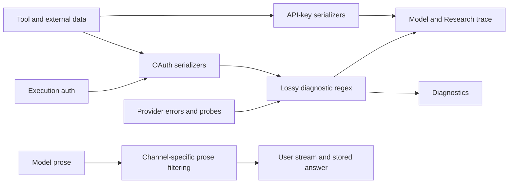
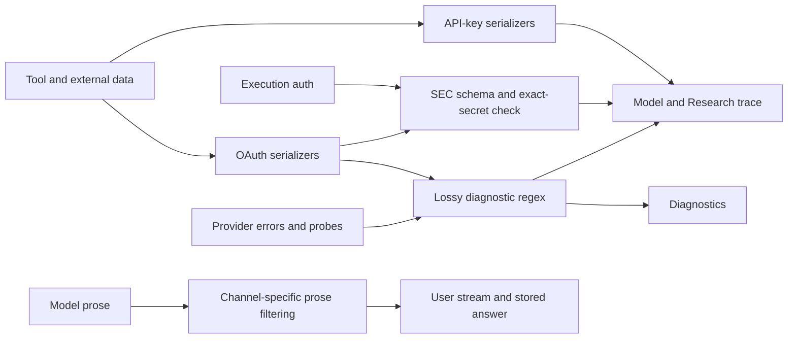
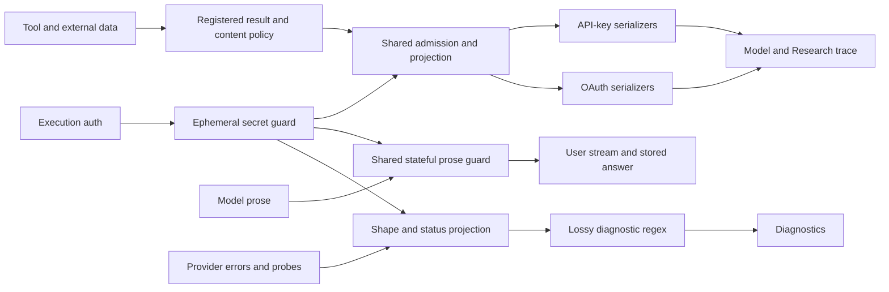

# Security Hardening Proposal: Contextual Research Output Policy

## Decision

Pending user approval. We are deciding which component owns safe research
content, not which financial strings deserve an exception to a regex.

## Executive Recommendation

The two options are **Option 1: SEC-local validated exception**, preserving the
current adapter-specific structure, and **Option 2: Shared contextual output
boundary**, separating public data from diagnostics across four transports.
I recommend Option 2. We have reproduced a broader content-policy mismatch;
the narrow option remains viable only if immediate SEC delivery takes precedence
over correcting that shared design.

## Evidence

I read the current source rather than infer protection from counts of `redact`
calls. The exact source identities and synthetic observations are in
[observations](../observations.json). HEAD is accompanied by an uncommitted
Task2 patch; these findings are not attributed to a clean commit alone.

| Evidence | Title and location | What it establishes |
| --- | --- | --- |
| E1 | Diagnostic scrubber, `src/auth_drivers/probe_harness.py:1,28,57` | Observed: raw values should not enter probe diagnostics; the regex is a deliberately lossy safety net. |
| E2 | OAuth output sinks, `src/auth_drivers/chatgpt_oauth_driver.py:115,513,644,714`; `claude_code_sdk_driver.py:147,212,300,699,753` | Observed: successful tools use broad redaction in both OAuth bridges; ChatGPT prose does too, while Claude prose uses exact-token replacement. |
| E3 | API-key serialization and error handling, `src/agents/openai_agent/tools.py:28`, `src/agents/anthropic_agent/tools.py:1264`, `src/auth_drivers/runtime_binding.py:98` | Observed: successful serialization differs from OAuth, but API-key errors do have captured-key plus generic redaction. Zero calls in a tools file does not mean zero protection. |
| E4 | SEC domain contracts, `src/sec_research/facts.py:61,80`, `documents.py:35`, `queries.py:38,88`, `document_queries.py:18,47` | Observed: exact Decimal TEXT, prefixed capture IDs and request-bound cursors are functional data. |
| E5 | Fresh adapter reproduction, `redaction-architecture-checkpoint-01` in this release plan's scratch | Observed: eight selected real adapter cases produce four API-key passes and four OAuth assertion failures; no setup errors. |
| E6 | Synthetic string-function probes, [observations](../observations.json) | Observed: accession, URL, numbers, hashes and `Consolidated` are corrupted; separately handled short token fragments reassemble to the synthetic secret. Not an end-to-end disclosure test. |
| E7 | Result-policy ownership, `src/tools/registry.py:31`, `src/sec_research/tool_results.py:25,33,72` | Observed: registry contracts describe inputs, while the paused SEC boundary has only shallow envelope validation and transport-supplied redaction. |

The structural diagnosis is an inference from these observations: one lossy
diagnostic algorithm has acquired incompatible responsibilities as a data
serializer, credential control and prose filter. A shape test cannot establish
whether an arbitrary opaque string is public or secret. The current mismatch is
therefore not solved by a more elaborate shape test alone.

The review's suggested patterns need correction before any use. A capture ID is
`secdoc_` followed by 64 lowercase hex characters, not bare hex. We should use
ASCII digit contracts rather than Python's Unicode-aware `\d` where the domain
requires ASCII. Decimal TEXT may include scientific notation, because finite
Decimal values are stored using `str(value)`. URL admission needs parsed exact
host/path and accession/document relationships, not a trusted prefix. Canonical
cursor decoding is necessary but not sufficient: request and snapshot bindings
must also match. None of these valid shapes exempts an exact known credential.

## Current Design And Failure Mode

We already have an execution auth binding which is intentionally nonserializable
and carries the selected credential in memory. That is an appropriate starting
point. The problem appears later: successful results are serialized separately
by each adapter, and OAuth adds a broad regex to content that needs lossless
values. The partial SEC patch avoids destroying JSON syntax but still changes
its semantic values. The next cursor then fails its canonical decoder.

The same shape rule reaches ChatGPT answer deltas. Thus even after a local SEC
field exception, an answer repeating a financial amount or accession can be
altered again. Claude has already recognized the prose problem in its exact-only
scrubber, but independent replacements do not carry state between fragments.
We should not claim that a final sanitized answer repairs an already-emitted
stream fragment. API-key error guards must also be preserved; widening the
analysis does not imply that they are absent.

## Desired Invariants

- Credentials stay in auth/transport-owned ephemeral state, never ordinary tool
  records, prompts, debug dumps or persisted policy objects. Guards use secrets
  already captured for authorized execution, not a scan of every saved account.
- Safe tool data is validated at the emission boundary before sizing, rendering,
  previews or persistence. Policy is registered by trusted code and full result
  type, never selected by a payload field or an arbitrary field-name whitelist.
- The same safe result has equal canonical data, exact number strings, URLs,
  hashes, references and cursors in four channels. SDK wrappers and call IDs are
  not required to be byte-identical wire protocols.
- Known-secret matches and invalid structural fields produce a bounded typed
  failure, not altered IDs inside an apparently successful result. Unknown
  schema fields do not inherit permission.
- Human-readable research prose is not a diagnostic dump. Ordinary words, long
  numbers, source URLs and public identifiers survive. Explicit secret-field
  policy and bounded credential syntax checks remain; length/entropy alone is
  not decisive. Diagnostic output still favors shape/status over raw values.
- Streaming protection carries bounded state across fragments, redacts before
  public/durable emission and handles cancellation/final flush without exposing
  a pending credential prefix. Per-message replacement is not this contract.
- A modified quoted passage never claims byte-exact source text. Citations and
  originals remain separate from safe display projections, with a typed gap or
  non-exact display status owned outside immutable citation identities.

## Constraints And Non-Goals

No provider/model/auth/effort fallback changes. Do not read live tokens or change
production stores to design this boundary. Keep current size/cancellation limits,
credential isolation, typed errors and existing probe regressions. No new DLP
service, sandbox, dependency or LLM-based secret classifier is justified here.
The XML data wrapper remains a prompt convention, not proof of injection safety.
This analysis does not claim a repository-wide security audit or the detection
of all unknown secrets in arbitrary untrusted prose.

## Before Architecture

The relevant split is before model context and user-visible events. Diagnostics
reuse the same algorithm, but have a different acceptable loss of detail.

Source: [before diagram](../diagrams/contextual-output-policy-before.mmd).
The shared regex node is a control dependency, not a shared process. Error
binding protections exist around it and are abbreviated in the diagram.

## Options

### Option 1: SEC-Local Validated Exception

We can retain the present bridge structure and give SEC results a complete
closed schema at the OAuth redaction boundary. Every structural value would be
validated as a whole, checked against known secrets and preserved if admitted;
free text would retain the current regex. This is a small, reversible way to
finish the failing cursor and exact-value cases without weakening the diagnostic
rules used elsewhere. Invalid structures would return typed failure, not demand
that every bad field literally become `[REDACTED]`.

Its limitation is concrete rather than aesthetic: ChatGPT prose can still
corrupt values after the model repeats them, other tools retain the same
asymmetry, and fragment handling remains separate. We would need an additional
prose/stream patch to solve those observations. The schema walk adds bounded
work to SEC calls, but no new process or network hop. No timing or RSS advantage
has been measured. The smaller touched set makes rollback straightforward,
provided an unsupported SEC path fails closed rather than returning damaged
provenance. This option makes sense as a consciously temporary delivery choice.

Source: [Option 1 diagram](../diagrams/contextual-output-policy-sec-local-after.mmd).

| Change | Before | After | Security consequence | Cost |
| --- | --- | --- | --- | --- |
| SEC structural values | Whole-text regex | Closed schema plus known-secret check | Protects integrity without blanket secret exemption | SEC-specific contract maintenance |
| Other tools and prose | Channel-specific | Unchanged | Root inconsistency and fragment limit remain | Later patches still needed |

We should not label this a shared solution merely because SEC has one helper.
It deliberately accepts the remaining inconsistent owners.

### Option 2: Shared Contextual Output Boundary

We can instead make safe output a common Research responsibility. Each registered
tool supplies a result contract or an explicitly reviewed content policy. A
shared boundary validates it, checks the execution's ephemeral secret guard and
produces an admitted data representation. All four adapters then only format
that representation for their SDK. Domain validation remains with the domain;
the common boundary owns enforcement and does not contain a growing collection
of `if tool == SEC` exceptions. This changes registry/result contracts, so it is
an architectural change rather than a rename of the existing helper.

We would distinguish diagnostic emission from research emission. Diagnostics
prefer stable codes, shapes and bounded context, with the current fail-closed
regex retained as a final safety net. Public research data and prose would not
be filtered by opaque-string length. Credential-bearing types/fields are denied,
known execution secrets and explicitly supported encoded forms are blocked, and
clear credential syntax is handled separately from ordinary public values.
Public author names or official document contact text are not automatically
equivalent to authentication metadata; any personal-data restriction must be
explicit in the registered content policy rather than silently inherited from
a probe's email rule.

The guard must be available before an SDK, reducer, callback or UI trace can
emit the value. It should receive a nonserializable policy/guard handle, not
forward raw credentials into tool arguments. Child and refreshed credentials
used by that execution require scoped lifetime handling so late errors cannot
escape after the parent binding changes. We must never populate the guard by
enumerating unrelated stored credentials. Encoded matching must be bounded and
explicit; arbitrary transformations cannot be recognized reliably.

Answers need a stream-aware path through the same owner. A bounded matcher can
retain only a suffix that might begin a protected value and emit safe prefixes.
That introduces state and possibly a delay when text resembles a credential
prefix. We must measure it, and define fail-closed behavior at buffer limits,
cancellation and final flush. This is preferable to claiming that a stateless
replace catches fragmented secrets. It also means normal prose and quoted data
need positive controls, not just negative secret-shaped fixtures.

The likely cost is integration and contract review, not infrastructure. We add
validation/scanning over already bounded outputs, per-stream state and typed
policies for heterogeneous tools. We should inventory those shapes first and
avoid breaking live custom or string-returning tools by suddenly treating all
unmodeled output as unusable. Introduction can be producer-by-producer, with
all four transports switched together for each covered contract. This is a
transition schedule for one shared design, not permission to leave permanent
per-tool bypasses. Rollback should disable a failing new capability or revert an
unreleased batch without weakening diagnostic protection.

Source: [Option 2 diagram](../diagrams/contextual-output-policy-contextual-shared-after.mmd).

| Change | Before | After | Security consequence | Cost |
| --- | --- | --- | --- | --- |
| Policy owner | Adapter and SEC callback | Registered contract plus shared admission | No channel-selected data integrity rule | Registry/adapters need coordinated review |
| Public data versus diagnostics | Same lossy regex | Separate projections | Public integrity and diagnostic secrecy can both be tested | Explicit data classification |
| Streaming | Independent replacements | Bounded stateful guard | Tested protection across fragment boundaries | State, flush rules and latency measurement |
| Auth context | Several local scrubbers | Execution-scoped guard | Known-secret policy follows authorized execution | Child/refresh lifetime tests |

This boundary does not make arbitrary JSON trustworthy. Its value is that every
output has an accountable policy and a single enforcement path. Unrecognized
payloads cannot choose a weaker policy, and the model cannot grant an exemption.

## Comparison

These directions are source-derived or hypothetical, not benchmark results.
Both options keep the same source data and avoid new provider calls.

| Dimension | Option 1 | Option 2 | Confidence and validation |
| --- | --- | --- | --- |
| Security | SEC integrity improves; other mismatches remain | Common policy and streaming protection improve coverage; unknown encoded secrets remain a limit | Medium; real adapter, persistence and adversarial matrix |
| Performance | Extra SEC schema walk | Shared validation, scan and stream matcher | Medium source-derived mechanism; compare CPU and first-visible-text delay on identical fixtures |
| Memory | Bounded SEC validation state | Per-result validation plus per-stream pending-prefix state | Medium; measure peak RSS and enforce existing result limits plus explicit stream bounds |
| Reliability | Narrow failure surface | Fewer divergent owners, larger integration surface | Medium; malformed result and lifecycle/cancellation controls |
| Operability | Another special policy to track | One typed status/diagnostic owner, no new service | Medium; verify logs contain codes/counts but no payload secrets |
| Migration | Narrow SEC patch | Inventory all live result shapes and migrate four-channel groups | High source-derived; registry completeness and live-call positive controls |
| Developer ergonomics | Fast first repair, later exceptions likely | Tool authors declare output contracts; shared tests enforce them | Medium; require a new-tool contract test |
| Reversibility | Revert SEC-only batch | Revert unreleased groups or disable the affected capability | Medium; neither rollback may emit corrupted citations or remove diagnostics |

Option 2 pays more up front because the existing input registry is not already a
result-policy system. We should acknowledge that work explicitly rather than
describe it as simply moving a function. If the inventory reveals materially
more integration work than expected, we can reconsider the temporary local
option without pretending it solves the broader observations.

## Recommendation

I recommend the shared contextual boundary because the user prioritizes a clean
mechanism over a succession of subsystem exceptions, and the inspected prose
callers already reproduce the same category of failure. Merely relaxing `_RULES`
would lose diagnostic protections while leaving classification and streaming
unsolved. Merely moving the same rules into a new module would change nothing.
Option 1 is preferable only if the user explicitly chooses a temporary SEC-only
delivery with the remaining limitations recorded.

## Evidence Coverage And Residual Risk

| Evidence | Option 1 | Option 2 |
| --- | --- | --- |
| E1 diagnostic scrubber | Unaffected; existing tests remain required | Diagnostic behavior preserved and isolated; existing tests remain required |
| E2 OAuth prose/result split | Mitigates SEC subset only | Addresses covered result/prose paths after all adapters are wired |
| E3 API/error behavior | Leaves success-policy difference elsewhere | Aligns success policy while preserving error guards |
| E4/E5 SEC values and failing pages | Addresses with direct contract patch | Addresses through shared owner plus SEC contract |
| E6 fragment and ordinary-word probes | Unaffected outside SEC fields | Addresses named probes only after stateful guard and positive controls |
| E7 missing common result policy | Unaffected | Addresses by adding explicit ownership |

All coverage is proposed. Neither option is implemented or verified as a fix.
Schema conformance is not proof that a value is nonsecret, source truth, or safe
from prompt injection. Unknown secrets, arbitrary encoding and secrets outside
the captured execution context are residual risks; minimizing credential access
and avoiding raw diagnostic dumps remain essential under both options.

## Migration And Rollout

Freeze the existing failed checkpoint; do not silently reinterpret the user's
root-level question as approval of the narrower exception. After selection,
inventory actual producers and sinks, add the common boundary with no production
activation, and wire each covered tool across all four transports atomically.
Include ordinary news/prices and answer streams before claiming the root issue
closed. Existing diagnostic protections remain until replacement owners pass.
Only then resume citation persistence, export, recovery and scheduling. Existing
stored source bytes and conversations are not rewritten by this policy change.

## Validation Plan

Use synthetic credentials, including a pure numeric value and a valid-looking
64-hex value deliberately registered as secrets. A domain match must not defeat
known-secret protection. Also exercise JWT/Bearer-shaped strings in every
structural field, unknown keys, changed URL hosts/paths, cursor filter/snapshot
changes, duplicate keys, malformed numbers and legitimate Decimal exponents.

For safe identical inputs, compare canonical admitted payloads through all four
real adapter entrypoints, including provenance, quotes, cursors and the next
request. Add ordinary long words, news URLs and price/financial numbers so the
test cannot pass by making every channel equally lossy. Invalid structures must
return typed failure without echoing the rejected value; a literal redaction
marker inside a broken identifier is not the acceptance criterion.

Exercise every secret split point, encoded known variants, tool/answer events,
previews, retries, child bindings, refresh, cancellation, final flush and durable
Research trace. No known protected sequence may emerge in the concatenated
public stream or stored answer. Test projection/exact-citation status separately
from raw source storage, and retain probe/API error regression owners unchanged.

Measure CPU, peak RSS and first-visible-text latency against identical bounded
small/maximum results and streams. Thresholds must be declared after collecting
the baseline, before candidate measurement; none is invented here. Every new
load-bearing branch needs a named behavioral inverse and restored-source proof.

## Implementation Work Packages

Planning is not yet authorized. The selected design would require an output
inventory, common policy/secret-lifetime owner, four-adapter integration, stateful
answer emission, persistence/citation alignment, then adversarial and existing
regression gates. No package in this analysis is reported as completed work.

## Open Questions

Does the user approve Option 2's changed public-content policy and larger shared
integration scope? No live access, destructive cleanup, merge or push approval
is included in that decision. Concrete result inventories and stream budgets
belong in the subsequent implementation plan, not an assumed existing framework.
